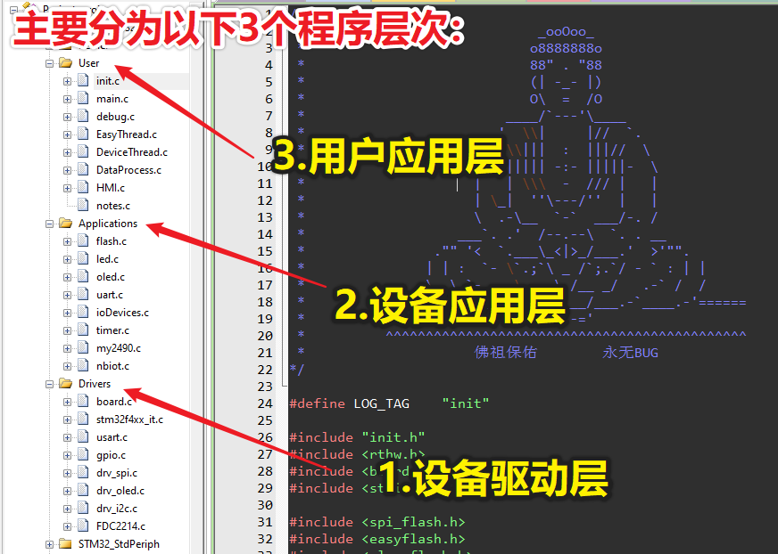
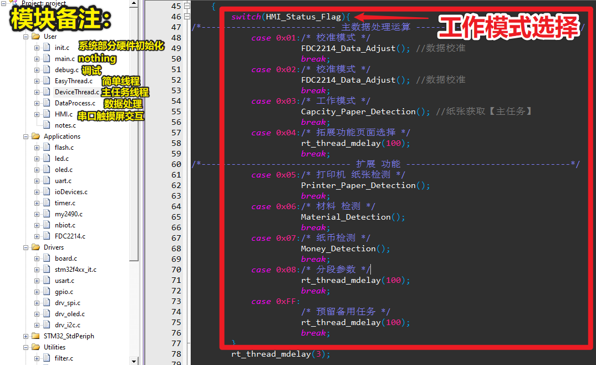

## 1. 程序描述与思路:book:

### 1.1 系统总体工作流程

> 软件部分主要分成用户交互设计以及数据处理算法设计，基于RT-Thread实时操作系统，利用系统的线程调度完成各个模块的程序处理，应用线程总体分为：

- 1.简单设备运行线程
    - LED
	- OLED
	- Buzzer
	- Flash
	
- 2.主测量引用线程
	- HMI屏幕交互
	- FD2214数据获取与转换
	- 语音模块交互
	
- 3.系统监控线程
	- Watch Dog

### 1.2 程序设计思路

> 在整体软件中，首先在触摸屏菜单进行人机交互，进入不同的功能调用不同的控制函数与数据处理算法。程序线程调度，主要分为简单任务以及核心算法算法任务。简单任务为IO设备、触摸屏、OLED屏幕、语音模块、NB-IOT模块等设备控制；核心控制算法任务为FDC2214电容模拟值采集、卡尔曼滤波以及模糊求解最大可能性落点区间，从而得到当前纸张数量。



- [x] 1.首先在`设备驱动层`中构建好设备的底层硬件驱动程序，以供中层的`设备应用层`调用
- [x] 2.其次在`设备应用层`封装好相应的设备应用程序，留好相应的接口，以供上层`用户应用层`调用，例如：
	- **RGB LED**控制调用（参数：模式、颜色）
	- **蜂鸣器**控制调用（参数：响几声、响多长）
	- **语音模块**控制调用（参数：语音内容）
	- **OLED**控制调用（函数：显示对应的模式内容）
	- **Flash**控制调用（函数：读写参数）
	- **Uart**控制调用（函数：数据接收回调）
	- **FDC2214**控制调用（函数：获取电容值）
- [x] 3.最后在`用户应用层`中进行相应的**3.1 调试工具**、**3.2 模块交互封装**以及**3.3 数据处理**。

---
- 3.1 【调试工具】 在`debug.c`其中存放的为山外上位机示波器数据发送函数，用来分析数据较为合适。
	- eg:[这张图片是在调试PID与角度响应时所记录](../docs/pictures/debug.png "PID_debug")

- 3.2 【模块交互封装】 在`HMI.c`其中存放的为串口触摸屏的数据交互函封装(其中最重要的为：串口屏数据解析函数`HMI_Data_Analysis()`)

- 3.3 【数据处理】 最重要的为`DeviceThread.c`，其中存放工作模式的选择、运行线程以及调试
	- 1.数据校准：`FDC2214_Data_Adjust()`
	- 2.工作模式:`Capcity_Paper_Detection()`
	- 3.扩展功能模式：
		- ①打印机 纸张检测：`Printer_Paper_Detection()`
		- ②材料 检测：`Material_Detection()`
		- ③纸币 检测：`Money_Detection()`

- 工作模式选择，其与OLED页面对应


> 工作模式的选择来自于 变量`HMI_Status_Flag`，其为解析 触摸屏按钮所发出的数据包，而获得的工作模式。


## 2. 纸张数量程序的具体实现
### 2.1 获取电容值

1.首先准备就绪后，构建系统工作的参数结构体：
```c
typedef struct
{
	uint8 Status;      //检测时状态
	uint8 ShortStatus; //短路的状态
	uint8 Finish_Flag; //读取完成的标志
	uint8 PaperNumber; //纸张数量
	float Capacitance; //电容值
	
	int Time; //时间
}PaperCountEngine_Type;//纸张测数器状态
```
```c
//初始化变量Paper```c

PaperCountEngine_Type Paper = {
		.Finish_Flag = 2
};/*Paper数据结构体*/
```

> 用的是FDC2214第4通道，调用来自`设备应用层`的FDC采集函数，如下：
```c
/**
  * @brief  get_single_capacity 获取极板容值
  * @param  None
  * @retval 电容值
  * @notice 
  */
float get_single_capacity(void)
{
		static unsigned int res_CH4_DATA = 0;
		static float res_ch4 = 0.0f;
		
		FDC2214_GetChannelData(FDC2214_Channel_3, &res_CH4_DATA);
		res_ch4 = Cap_Calculate(&res_CH4_DATA);

		return res_ch4;
}
```

### 2.2 初始化电容值分割区间
> 根据FLASH中存入的电容值，划分区间
```c
/**
  * @brief  DataSubsection 电容值分割，获取区间
  * @param  Cap_Division电容切分后的值、arrey事先存入的电容值
  * @retval 
  * @notice 
  */
void DataSubsection(float Cap_Division[],float arrey[],int Number)
{

		static int rec = 1;
		
		for(int i = 2;i <= 30;i++){
				CapacitanceDP = (arrey[i-1]-arrey[i]) /2.0f;
				Cap_Division[i-1]= arrey[i-1]-CapacitanceDP;

		}
		for(int i=31;i<=40;i++){
				CapacitanceDP = Div_Parameter.Div_30_40*(arrey[i-1]-arrey[i]) /100.0f;
				Cap_Division[i-1]= arrey[i-1]-CapacitanceDP;
		}
		for(int i=41;i<=50;i++){
				CapacitanceDP = Div_Parameter.Div_40_50*(arrey[i-1]-arrey[i]) /100.0f;
				Cap_Division[i-1]= arrey[i-1]-CapacitanceDP;
		}
		
		for(int i=51;i<=60;i++){
				CapacitanceDP = Div_Parameter.Div_50_60*(arrey[i-1]-arrey[i]) /100.0f;
				Cap_Division[i-1]= arrey[i-1]-CapacitanceDP;
		}
		for(int i=61;i<=70;i++){
				CapacitanceDP = Div_Parameter.Div_60_70*(arrey[i-1]-arrey[i]) /100.0f;
				Cap_Division[i-1]= arrey[i-1]-CapacitanceDP;
		}
		for(int i=71;i<=80;i++){
				CapacitanceDP = Div_Parameter.Div_70_80*(arrey[i-1]-arrey[i]) /100.0f;
				Cap_Division[i-1]= arrey[i-1]-CapacitanceDP;
		}
		for(int i=81;i<=90;i++){
				CapacitanceDP = Div_Parameter.Div_80_90*(arrey[i-1]-arrey[i]) /100.0f;
				Cap_Division[i-1]= arrey[i-1]-CapacitanceDP;
		}				
		for(int i=91;i<=100;i++){
				CapacitanceDP = Div_Parameter.Div_90_100*(arrey[i-1]-arrey[i]) /100.0f;
				Cap_Division[i-1]= arrey[i-1]-CapacitanceDP;
		}				
		if(rec==1){
				Cap_Division[0] =arrey[1]+(arrey[1]-arrey[2]) /2.0f;
				rec = 0;
		}
}
```

### 2.3 根据区间推测落点

> 根据区间获取落点
```c
/**
  * @brief  ProbablityCapacitance 根据分割函数，获取可能的纸张数量
  * @param  50组电容值地址
  * @retval 电容值
  * @notice 按最大百分比返回对应的纸张数，因此只是可能值
  */
uint8 ProbablityCapacitance(float CompareArrey[])	//传入 需要比较的数据
{

		memset(Cap_Probability,0,sizeof(Cap_Probability));//清空电容值落点可能性
	
		for(int i=0;i <= Level;i++ ){
				for(int j=0; j<10 ;j++){
						if( (CompareArrey[j] < Cap_Division[i])  && (CompareArrey[j] >= Cap_Division[i+1])){
								Cap_Probability[i]++;
						}
				}
		}
		for(int n = 0;n < Level ;n++){
				if(Cap_Probability[n] > Cap_Probability[Probability_Max]){
						Probability_Max = (n + 1);
				}
				if(Cap_Probability[0] >= 5){	//纸张数的特殊处理
						Probability_Max = 1;
				}	
		}
		
		if(0 == Cap_Probability[Probability_Max-1]){
				Probability_Max = 0;
		}
		return Probability_Max;
}
```


### 2.4 转换为纸张数量

> 采集50组电容值数据，进行比较数据，获取最大可能性的落点
> 在比较数据，获取最终纸张数前，设置调度器上锁（上锁后，将不再切换到其他线程，仅响应中断），以防被打断造成数据出错
```c
void Get_Paper(void){

	for(int i = 0;i < 10;i++){
		Cap_Value[i] = get_single_capacity();//获取50组数据
	}	
    rt_enter_critical(); /* 调度器上锁 */
	Paper.PaperNumber = ProbablityCapacitance(Cap_Value);	//比较数据，获取最终 纸张数
    rt_exit_critical();	 /* 调度器解锁 */	 
}
```


## 3.串口触摸屏交互
### 3.1 串口屏返回数据解析
> 数据包格式如下：

| 编号 | 1 | 2 | 3 | 4 | 5 | 6 |
| :---: |:---: | :---: | :---: | :---: | :---: | :---: |
| 数据包所代表 | 包头1 | 包头2 | 数据包长度（不包括包头包尾及本身） | 工作模式位（页面） | 返回数据 | 累加和校验位 |
| 具体描述(16进制) | AA |55 | 02 | xx | xx | SUM |  

```c
/**
  * @brief  HMI_Data_Analysis(串口屏返回数据解析)
  * @param  控制字符数据 uint8 Data
  * @retval None
  * @notice 从第四个字节开始为数据字节
  */
void HMI_Data_Analysis(uint8 Data) //控制数据解析
{

		static uint8 i = 0;	   		  //
		static uint8 RxCheck = 0;	  //尾校验字
		static uint8 RxCount = 0;	  //接收计数

	
		hmi_data[RxCount++] = Data;	//将收到的数据存入缓冲区中
	
		if(RxCount <= (HMI_LEN+4)){ //定义数据长度未包括包头和包长3个字节,+4)  
				if(hmi_data[0] == 0xAA){ //接收到包头0xAA
						if(RxCount > 3){
								if(hmi_data[1] == 0x55){ //接收到包头0x55
										if(RxCount >= hmi_data[2]+4){ //接收到数据包长度位，开始判断什么时候开始计算校验
												for(i = 0;i <= (RxCount-2);i++){ //累加和校验
														RxCheck += hmi_data[i];
												}
			
												if(RxCheck == hmi_data[RxCount-1]){
														hmi_data_ok = 1; //接收数据包成功
												}
												else {hmi_data_ok = 0;}
												
												RxCheck = 0; //接收完成清零
												RxCount = 0;	
										}
								}
								else {hmi_data_ok = 0;RxCount = 0;hmi_data_ok = 0;} //接收不成功清零
						}
				}
				else {hmi_data_ok = 0;RxCount = 0;hmi_data_ok = 0;} //接收不成功清零
		}
		else {hmi_data_ok = 0;RxCount = 0;hmi_data_ok = 0;} //接收不成功清零

		
		if(1 == hmi_data_ok){
				HMI_Status_Flag = hmi_data[3];//获取 工作模式位(页面)
				HMI_Data = hmi_data[4];//获取 返回的数据

				. /* 此处省略的为 数据解析后响应的处理函数 */
				.
				.
				.
				.
				. /* 此处省略的为 数据解析后响应的处理函数 */
		}
		hmi_data_ok = 0;
```

### 3.2 向串口屏发送纸张数量
```c

//76 61 31 2E 76 61 6C 3D 31 30 30 ff ff ff  va1.val=100
/* 该串数据用字符表达，即为： va1.val=100 */
uint8 him_uart_nmber_cmd[14] = {0x76,0x61,0x31,0x2E,0x76,0x61,0x6C,0x3D,0x31,0x30,0x30,0xff,0xff,0xff};
/*                                v    a   l     .   v     a    l    =   1     0    0      结束符     */

void uart_send_hmi_paper_numer(uint8 N_number)  //发送给hmi 纸张数量
{ 	

		him_uart_nmber_cmd[8]  = (N_number/100%10) + 0x30; //百位
		him_uart_nmber_cmd[9]  = (N_number/10%10) + 0x30; //十位
		him_uart_nmber_cmd[10] = (N_number/1%10) + 0x30;//个位
	
		rt_device_write(focus_uart_device, 0,him_uart_nmber_cmd	, sizeof(him_uart_nmber_cmd));	

}
```


## 4.程序流程图


## 5、测试数据分析

(1)
保持测试环境不变，采集50个样本，通过MATLAB拟合出纸张页数与传感器原始数据的曲线关系，如图4-2所示。


**图4-2 纸张页数与模拟量的拟合函数关系图**

(2) 根据(1)中采集的50个样本，确定电容模拟值及纸张数的论域，划分模糊子集，如表4-1
所示。

**表4-1页数与模拟量区间对应表**

| 页数/张 | 对应模拟量区间    | 页数/张 | 对应模拟量区间  |
|---------|-------------------|---------|-----------------|
| 1       | [1680.00,1345.34] | 6       | [682.48,633.84] |
| 2       | [1345.34,1013.26] | 7       | [633.84,598.03] |
| 3       | [1013.26,845.12]  | 8       | [598.03,569.46] |
| 4       | [845.12,748.79]   | 9       | [569.46,546.28] |
| 5       | [748.79,682.48]   | 10      | [546.28,529.16] |

(3)
根据（2）中划分的模糊子集，保持测试环境不变，固定测量35张纸张，采集数据如表4-2所示，采集到的原始数据90%落入35张页数所对应的区间[401.35,399.50]，如图4-3所示。


**表4-2 纸张数为35的实时数据**

| 测试组别 | 原始数据 | 测试组别 | 原始数据 |
|----------|----------|----------|----------|
| 1        | 400.896  | 6        | 400.824  |
| 2        | 401.049  | 7        | 400.591  |
| 3        | 400.157  | 8        | 401.111  |
| 4        | 399.912  | 9        | 400.443  |
| 5        | 401.125  | 10       | 398.529  |

>   **图4-3 纸张数为35的分布区间图**

(4)
根据（2）中划分的模糊子集，保持测试环境不变，固定测量46张纸张，采集数据如表4-3所示，模拟值大部分落入46张页数所对应的区间[383.6,382.7]，如图4-4所示。


**表4-3纸张数为46的实时数据**

| 测试组别 | 原始数据 | 测试组别 | 原始数据 |
|----------|----------|----------|----------|
| 1        | 383.1243 | 6        | 385.6523 |
| 2        | 383.7841 | 7        | 382.9651 |
| 3        | 384.1236 | 8        | 382.2015 |
| 4        | 384.3164 | 9        | 383.7621 |
| 5        | 383.9984 | 10       | 384.1343 |

**图4-4 纸张数为46的分布区间图**

- 测试结果

**表4-4 工作模式下纸张测试结果表**

| 范围   | 测试次数 | 正确次数 | 正确率 |
|--------|----------|----------|--------|
| 1\~10  | 25       | 25       | 100%   |
| 11\~20 | 25       | 25       | 100%   |
| 20\~30 | 25       | 25       | 100%   |
| 30\~40 | 25       | 25       | 100%   |
| 40\~50 | 25       | 25       | 100%   |
| 50\~60 | 25       | 23       | 92%    |
| 60\~70 | 25       | 20       | 80%    |
| 70\~80 | 25       | 16       | 64%    |


